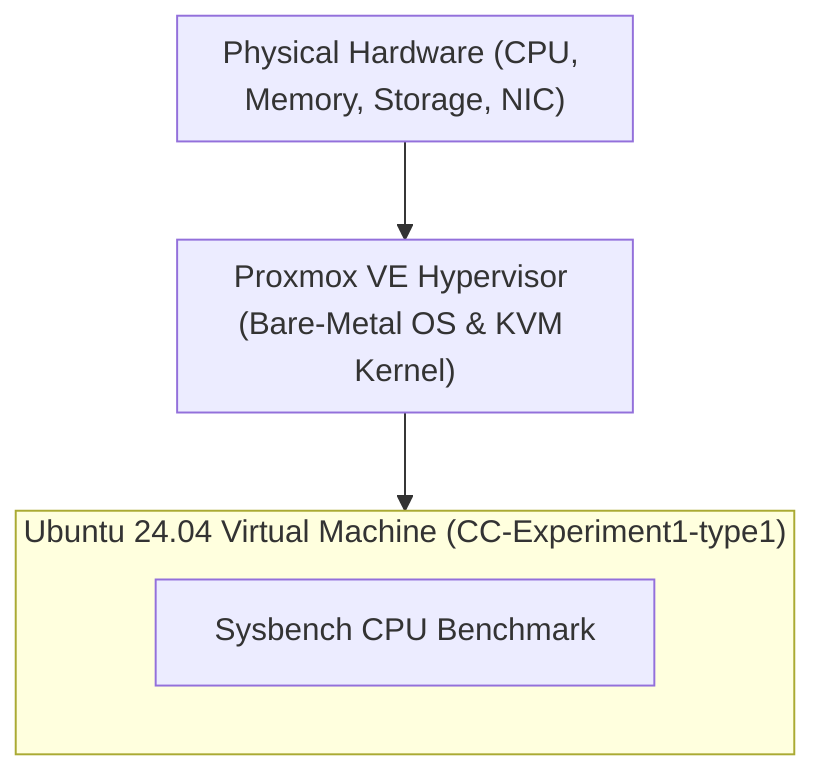
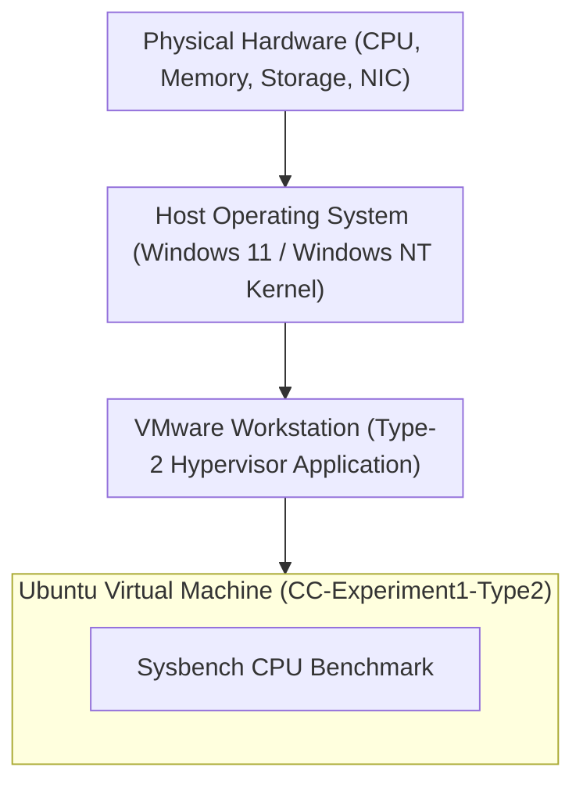

# Performance Analysis of Type-1 and Type-2 Hypervisors

[](#)
[](#)
[](#)
[](#)

---

## Executive Summary

This project performs a performance analysis of a Type-1 Hypervisor (Proxmox VE) and a Type-2 Hypervisor (VMware Workstation).

Identically configured Ubuntu virtual machines are used on both hypervisors to ensure a fair performance comparison. The CPU performance is evaluated using the Sysbench CPU benchmark with a maximum prime number value of 20,000.

The benchmark results are compared using:

- Total Execution Time
- Total Events
- Events per Second
- Average Latency

---
### Key Finding

> **Proxmox VE (Type-1 Hypervisor) achieved 1,716.69 Events/sec compared to VMware Workstation's 1,364.78 Events/sec — demonstrating a +25.79% throughput advantage and a 20.55% reduction in average latency.**

---

## 1. Project Objectives

The primary objectives of this Cloud Computing laboratory experiment are:

1. **Deployment**: Provision two identical Ubuntu Virtual Machines across different hypervisor architectures:
   - **Type-1 (Bare-Metal)**: Proxmox VE (Kernel-based Virtual Machine / KVM)
   - **Type-2 (Hosted)**: VMware Workstation Pro on a Windows Host OS
2. **Standardization**: Enforce uniform hardware resource allocations (2 vCPU, 2048 MB RAM, 20 GB Virtual Storage) to ensure direct comparability.
3. **Benchmarking**: Execute the `sysbench` CPU computational benchmark using 20,000 prime numbers to stress test CPU virtualization efficiency.
4. **Metric Collection**: Capture execution time, total events processed, throughput (events/sec), and latency statistics (min, avg, max, 95th percentile).
5. **Architectural Evaluation**: Quantify the performance overhead introduced by host operating system abstraction layers in Type-2 hypervisors versus bare-metal hypervisor execution.

---

## 2. Requirements

### Hardware and Software Requirements

| Component | Requirement |
|---|---|
| Type-1 Hypervisor | Proxmox VE |
| Type-2 Hypervisor | VMware Workstation |
| Guest Operating System | Ubuntu 22.04 or later |
| Web Browser | Google Chrome / Mozilla Firefox |
| Performance Testing Tool | Sysbench |
| Version Control System | Git |
| Remote Repository Platform | GitHub |

### VMware Workstation Requirements

- VMware Workstation
- Ubuntu ISO image
- Minimum 20 GB free disk space
- Minimum 4 GB available RAM
- Internet connectivity
- Git installed

---
## 2. Hypervisor Architectural Comparison

### Type-1 Hypervisor — Proxmox VE (Bare-Metal Architecture)

Proxmox VE runs directly on the bare-metal physical host hardware. The Linux kernel integrated with KVM (Kernel-based Virtual Machine) acts as the hypervisor. Guest operating system instructions execute directly on hardware CPU VT-x/AMD-V extensions without passing through an intermediate desktop operating system.



```
+-------------------------------------------------------------------+
|               Ubuntu Virtual Machine (Type-1 Guest)               |
+-------------------------------------------------------------------+
|               Proxmox VE Hypervisor (Linux Kernel / KVM)          |
+-------------------------------------------------------------------+
|                 Physical Server Hardware (Bare Metal)             |
+-------------------------------------------------------------------+
```

---

### Type-2 Hypervisor — VMware Workstation (Hosted Architecture)

VMware Workstation runs as an application process on top of a host operating system (Windows 11/10). CPU requests from the guest VM must navigate through the VMware VMM engine, translate through host OS system calls, and be scheduled by the Windows NT kernel scheduler before reaching physical hardware.



```
+-------------------------------------------------------------------+
|               Ubuntu Virtual Machine (Type-2 Guest)               |
+-------------------------------------------------------------------+
|               VMware Workstation (Virtual Machine Monitor)        |
+-------------------------------------------------------------------+
|               Host Operating System (Windows 11 / 10)             |
+-------------------------------------------------------------------+
|                        Physical PC Hardware                       |
+-------------------------------------------------------------------+
```

---
  ## 3. Virtual Machine Specifications

| **Resource Parameter** | **Proxmox VE (Type-1)** | **VMware Workstation (Type-2)** | **Status** |
|---|---|---|---|
| **Virtual Machine Name** | `CC-Experiment1-Proxmox` | `CC-Experiment1-VMware` | Standardized |
| **VM Identifier** | `Proxmox-VM-01` | `VMware-VM-01` | Standardized |
| **Guest Operating System** | Ubuntu 22.04+ | Ubuntu 22.04+ | Identical |
| **CPU Allocation** | 2 vCPU | 2 vCPU | Identical |
| **CPU Type / Model** | Virtual CPU | Virtual CPU | Standardized |
| **RAM Allocation** | 2 GB (2048 MB) | 2 GB (2048 MB) | Identical |
| **Virtual Disk Capacity** | 20 GB | 20 GB | Identical |
| **Virtual Network Adapter** | Virtual Network Adapter | VMware Virtual Network Adapter | Standardized |
| **Benchmark Tool** | `Sysbench` | `Sysbench` | Identical |
## 4. Experimental Procedure

### Step 1: Virtual Machine Creation & Setup

1. **Proxmox VE (Type-1)**:
   - Navigated to `https://10.11.0.252:8006` via browser.
   - Initialized `Create VM` wizard (VM ID: `123`, Name: `CC-Experiment1-type1`).
   - Attached Ubuntu 24.04 ISO, assigned 2 Cores, 2048 MiB RAM, 20 GB VirtIO disk, and `vmbr0` network bridge.
   - Completed standard Ubuntu server/desktop installation.

2. **VMware Workstation (Type-2)**:
   - Launched VMware Workstation application on Windows host.
   - Selected `Typical Configuration` wizard.
   - Mounted Ubuntu ISO, set name to `CC-Experiment1-Type2`.
   - Specified 20 GB virtual disk, configured 1 Processor with 2 Cores (2 vCPU total), 2 GB RAM, and NAT adapter.
   - Completed standard Ubuntu installation.

### Step 2: System Configuration Verification

On both guest OS terminals, system specs were verified prior to testing:

```bash
# 1. Verify Hostname & System Architecture
hostnamectl

# 2. Verify CPU Topology & Core Allocation
lscpu

# 3. Verify Memory Allocation
free -h

# 4. Verify Disk Partition Allocation
df -h

# 5. Monitor Real-time Process & System Load
top
```

### Step 3: Sysbench Benchmark Installation & Execution

```bash
# Package Index Update & Sysbench Installation
sudo apt update && sudo apt install sysbench -y

# Verify Version
sysbench --version

# Execute CPU Benchmark (Prime Calculation up to 20,000)
sysbench cpu --cpu-max-prime=20000 run
```

---
